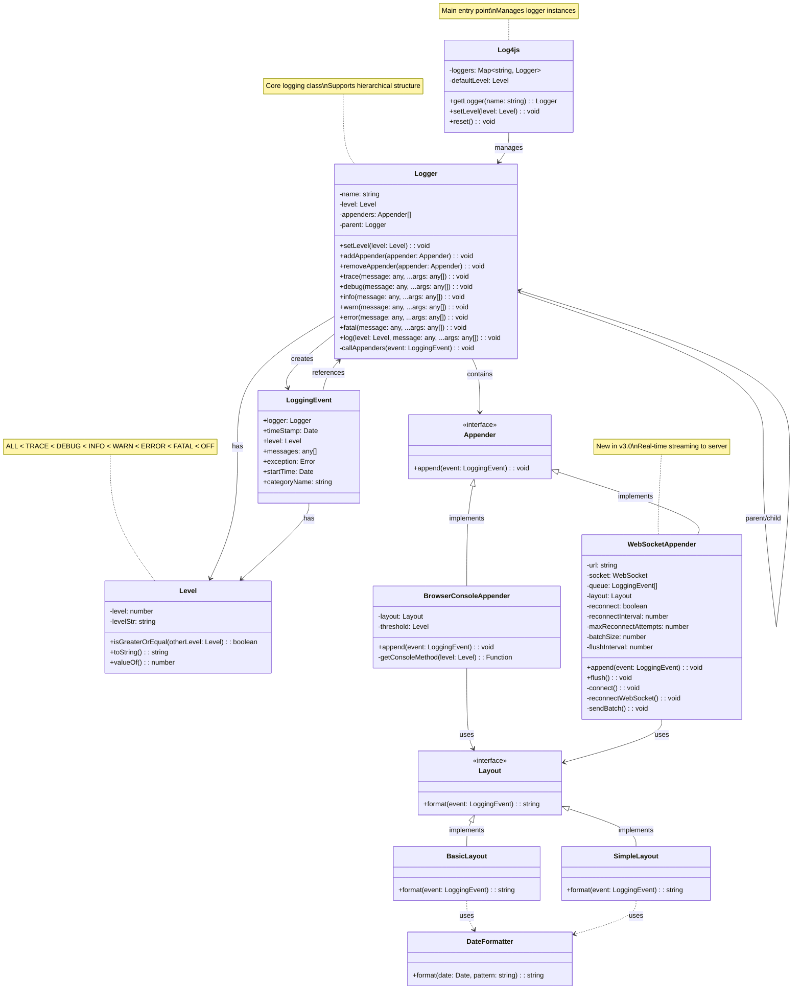
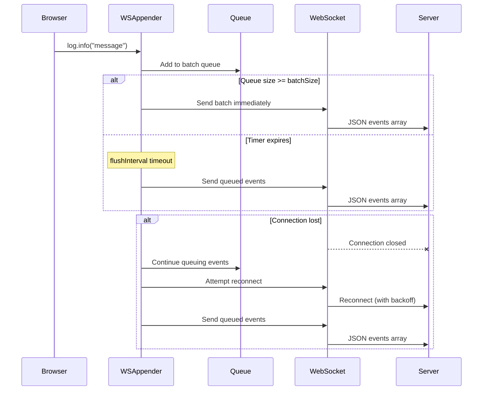

# Architecture

This page provides an overview of the Log4js architecture and class structure.

## Class Diagram

The following diagram illustrates the core classes and their relationships in Log4js v3.0:



## Key Components

### Log4js

The `Log4js` class is the main entry point and singleton that manages all logger instances. It provides:

- Logger creation and retrieval via `getLogger(name)`
- Global level configuration
- Logger hierarchy management
- Reset functionality

### Logger

The `Logger` class is the core logging component that:

- Maintains a hierarchical name structure (e.g., `app.module.component`)
- Supports multiple log levels (TRACE, DEBUG, INFO, WARN, ERROR, FATAL)
- Can have multiple appenders attached
- Inherits level and appenders from parent loggers if not explicitly set
- Creates `LoggingEvent` objects for each log call

### Level

The `Level` class represents logging severity levels with:

- Numeric values for comparison (ALL=0, TRACE=10000, DEBUG=20000, etc.)
- String representation
- Comparison methods
- Predefined static instances (Level.DEBUG, Level.INFO, etc.)

### LoggingEvent

A `LoggingEvent` represents a single logging occurrence and contains:

- Timestamp
- Log level
- Logger name (category)
- Log messages and arguments
- Optional exception/error
- Start time for performance tracking

### Appender Interface

Appenders receive logging events and output them to various destinations. The interface defines:

- `append(event: LoggingEvent)` - Main method to handle log events

Built-in appenders:
- **BrowserConsoleAppender**: Outputs to browser console (console.log, console.warn, etc.)
- **WebSocketAppender**: Streams events to a WebSocket server (new in v3.0)

### Layout Interface

Layouts format logging events into strings. The interface defines:

- `format(event: LoggingEvent)` - Converts event to formatted string

Built-in layouts:
- **BasicLayout**: Formatted output with timestamp, level, category, and message
- **SimpleLayout**: Simple output with just level and message

## Architecture Patterns

### Hierarchical Logger Structure

Loggers are organized hierarchically using dot-separated names:

```
app
├── app.auth
│   ├── app.auth.login
│   └── app.auth.logout
└── app.data
    ├── app.data.api
    └── app.data.cache
```

Child loggers inherit settings from parents unless explicitly overridden.

### Level Inheritance

If a logger doesn't have an explicit level set, it inherits from its parent:

```typescript
const rootLogger = Log4js.getLogger()
rootLogger.setLevel(Level.INFO)

const childLogger = Log4js.getLogger('app.module')
// childLogger inherits INFO level from root
```

### Multiple Appenders

Loggers can have multiple appenders, allowing output to multiple destinations:

```typescript
const logger = Log4js.getLogger('app')
logger.addAppender(new BrowserConsoleAppender())
logger.addAppender(new WebSocketAppender({ url: 'ws://localhost:3000/ws' }))
```

### Flexible Formatting

Layouts can be swapped on appenders to change output format:

```typescript
const appender = new BrowserConsoleAppender()
appender.setLayout(new BasicLayout())  // or new SimpleLayout()
```

## Modern TypeScript Features

### Type Safety

All components use TypeScript with strict mode for maximum type safety:

```typescript
class Logger {
  log<T extends any[]>(level: Level, message: any, ...args: T): void {
    // Fully typed method signature
  }
}
```

### ES6 Classes

Modern ES6 class syntax replaces prototype-based patterns:

```typescript
class Level {
  private readonly level: number
  private readonly levelStr: string
  
  constructor(level: number, levelStr: string) {
    this.level = level
    this.levelStr = levelStr
  }
  
  static readonly DEBUG = new Level(20000, 'DEBUG')
  static readonly INFO = new Level(30000, 'INFO')
}
```

### Map-Based Storage

Use of `Map` for efficient logger storage:

```typescript
class Log4js {
  private loggers = new Map<string, Logger>()
  
  getLogger(name: string): Logger {
    return this.loggers.get(name) ?? this.createLogger(name)
  }
}
```

## WebSocket Architecture (v3.0)

The new WebSocket appender introduces real-time streaming capabilities:



### WebSocket Flow

1. **Batching**: Events are queued and sent in batches for efficiency
2. **Auto-flush**: Batches are sent when size limit is reached or timer expires
3. **Reconnection**: Automatic reconnection with exponential backoff
4. **Offline Queue**: Events are queued when disconnected and sent on reconnection
5. **Server Processing**: Server receives, logs, and optionally stores events

## Migration from v2.x

Key architectural changes from v2.x:

1. **TypeScript**: Full type safety and modern syntax
2. **ES Modules**: Native ES module support
3. **Class-based**: All prototype patterns converted to ES6 classes
4. **Map Storage**: More efficient data structures
5. **WebSocket**: New real-time streaming capability
6. **Simplified**: Removed legacy browser compatibility code

See the [Migration Guide](/migration) for detailed upgrade instructions.

## Performance Considerations

### Batching Strategy

The WebSocket appender uses intelligent batching:

- **Batch Size**: Events accumulate until batch size is reached
- **Flush Interval**: Timeout ensures events aren't held too long
- **Manual Flush**: `flush()` method for explicit control

### Lazy Evaluation

Log messages are only formatted when needed:

```typescript
// Message only evaluated if level is enabled
logger.debug(() => expensiveOperation())
```

### Level Filtering

Events are filtered at the logger level before creating LoggingEvent objects, minimizing overhead for disabled log levels.

## Extensibility

### Custom Appenders

Create custom appenders by implementing the Appender interface:

```typescript
class CustomAppender implements Appender {
  append(event: LoggingEvent): void {
    // Custom logic here
  }
}
```

### Custom Layouts

Create custom layouts by implementing the Layout interface:

```typescript
class JSONLayout implements Layout {
  format(event: LoggingEvent): string {
    return JSON.stringify({
      timestamp: event.timeStamp,
      level: event.level.toString(),
      message: event.messages[0]
    })
  }
}
```

## Best Practices

1. **Use Hierarchical Names**: Organize loggers by module structure
2. **Set Appropriate Levels**: Use DEBUG/TRACE for development, INFO+ for production
3. **Leverage Multiple Appenders**: Console for development, WebSocket for production
4. **Implement Custom Appenders**: For specific output requirements
5. **Use Batching**: Enable batching for WebSocket to reduce network overhead
6. **Monitor Performance**: Track queue sizes and connection status

## See Also

- [Configuration Guide](/guide/configuration)
- [WebSocket Appender](/guide/websocket-appender)
- [TypeScript Usage](/guide/typescript)
- [Best Practices](/guide/best-practices)
